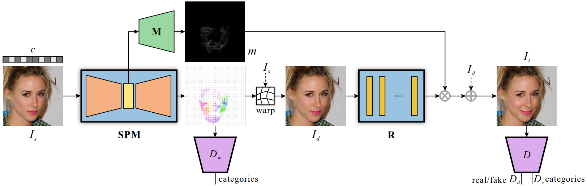

# ADSPM: Attribute-Driven Spontaneous Motion in Unpaired Image Translation

This repository provides a PyTorch implementation of [ADSPM](https://arxiv.org/abs/1907.01452).

<p align="center"></p>

<br/>

## Requirements
- Python 3.6
- PyTorch 0.4.1+

## Usage
- Download pretrained model. 

We provide \'Smiling\' model in 256x256 and 512x512 resolution. [\[Download\]](https://drive.google.com/open?id=1OMy9Vn2ulKGYk-MxOWUq1Ws4d6cacdrh)

- Testing with pretrained model with sample images:
```
python test_samples.py --ckpt PRETRAINED_MODEL_PATH  # 256x256 resolution model
```
```
python test_samples512.py --ckpt PRETRAINED_MODEL_PATH  # 512x512 resolution model
```

Then the generated images will be saved in `output` directory.


## Citation
If you use this code for your research, please cite our paper.
```
@inproceedings{wu2019attribute,
  title={Attribute-Driven Spontaneous Motion in Unpaired Image Translation},
  author={Wu, Ruizheng and Tao, Xin and Gu, Xiaodong and Shen, Xiaoyong and Jia, Jiaya},
  booktitle={Proceedings of the IEEE International Conference on Computer Vision (ICCV)},
  year={2019}
}
```


